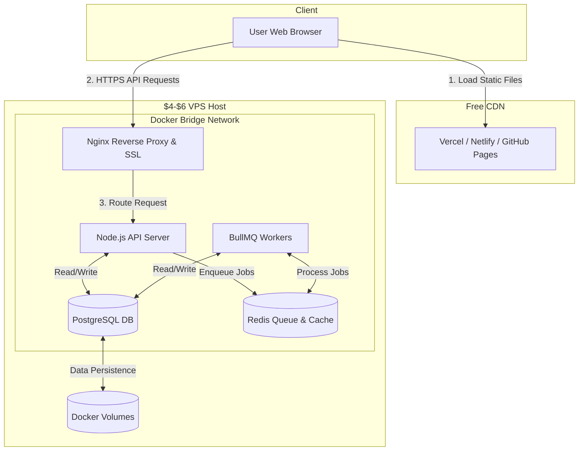

# Minimal Cost Hosting Analysis & Deployment Strategy

This document outlines the hosting options for the AI-Powered Personalized News Aggregator, comparing different deployment models to achieve the **absolute minimal cost** while satisfying the system's performance and data requirements.

---

## 1. Hosting Options Cost Comparison

To host this solution, we require hosting for four components:
1.  **Frontend Dashboard:** Static React SPA.
2.  **API Server & Workers:** Node.js runtime.
3.  **Database:** PostgreSQL.
4.  **Message Queue & Cache:** Redis.

Below is the comparative breakdown of hosting architectures:

| Component | Option C: Single-Instance VPS (Docker Compose) | Option D: Hybrid Serverless (Vercel + GitHub Actions) | Option E: **Fully Vercel Stack (Zero Cost)** |
| :--- | :--- | :--- | :--- |
| **Frontend** | Free (Vercel / Netlify / CDN) | Free (Vercel / Netlify) | **Free** (Vercel) |
| **API Server** | Shared VPS Resource ($0) | Free (Vercel Serverless Functions) | **Free** (Vercel Serverless Functions) |
| **Workers** | Shared VPS Resource ($0) | Free (Scheduled GitHub Actions Runner) | **Free** (Vercel Serverless + Cron / QStash) |
| **PostgreSQL**| Shared VPS Resource ($0) | Free (Neon Serverless Postgres / Supabase) | **Free** (Vercel Postgres / Neon) |
| **Redis / Queue**| Shared VPS Resource ($0) | Bypassed (Managed in DB) | **Free** (Vercel KV / Upstash Redis) |
| **Est. Total**| **$4 - $6 / month** (Flat Rate) | **$0.00 / month** | **$0.00 / month** |
| **Pros** | Simple architecture, standard BullMQ queues, no execution limits, no code workarounds. | Zero hosting cost, no server maintenance, runs simple Node scripts on GitHub actions without timeouts. | **All assets & state in one ecosystem (Vercel)**, zero cost, automated Vercel Cron scheduling. |
| **Cons** | VPS host crashes; manual OS updates and backups. | Out-of-ecosystem dependencies (GitHub Actions cron runner), scheduling delays. | Requires job chaining or state machine for large volumes of users or feeds. |

---

## 2. Option C: Single-Instance VPS ($4 - $6/month)

If a robust, real-time background processing queue is needed with standard libraries and zero execution time constraints, a single VPS running Docker Compose is the most straightforward option.



### 2.1 Reference Implementation: `docker-compose.yml`

To deploy this, we use a single `docker-compose.yml` configuration on our VPS. This keeps services containerized and reproducible.

```yaml
version: '3.8'

services:
  # 1. API Server & App
  api:
    image: news-aggregator-api:latest
    build:
      context: .
      dockerfile: Dockerfile
    restart: always
    environment:
      - NODE_ENV=production
      - PORT=3000
      - DB_HOST=postgres
      - DB_PORT=5432
      - DB_NAME=${POSTGRES_DB}
      - DB_USER=${POSTGRES_USER}
      - DB_PASSWORD=${POSTGRES_PASSWORD}
      - REDIS_URL=redis://redis:6379/0
      - ENCRYPTION_SECRET=${ENCRYPTION_SECRET} # Master encryption key
      - OPENAI_API_KEY=${OPENAI_API_KEY}
    expose:
      - "3000"
    depends_on:
      - postgres
      - redis

  # 2. BullMQ Worker Service
  worker:
    image: news-aggregator-api:latest # Reuses same build/image
    command: npm run start:worker
    restart: always
    environment:
      - NODE_ENV=production
      - DB_HOST=postgres
      - DB_PORT=5432
      - DB_NAME=${POSTGRES_DB}
      - DB_USER=${POSTGRES_USER}
      - DB_PASSWORD=${POSTGRES_PASSWORD}
      - REDIS_URL=redis://redis:6379/0
      - ENCRYPTION_SECRET=${ENCRYPTION_SECRET}
      - OPENAI_API_KEY=${OPENAI_API_KEY}
    depends_on:
      - postgres
      - redis

  # 3. Database Layer
  postgres:
    image: postgres:15-alpine
    restart: always
    environment:
      - POSTGRES_USER=${POSTGRES_USER}
      - POSTGRES_PASSWORD=${POSTGRES_PASSWORD}
      - POSTGRES_DB=${POSTGRES_DB}
    volumes:
      - pgdata:/var/lib/postgresql/data

  # 4. Queue / Caching Layer
  redis:
    image: redis:7-alpine
    restart: always
    command: redis-server --appendonly yes --auto-aof-rewrite-min-size 16mb # Persist queues and compact AOF aggressively
    volumes:
      - redisdata:/data

  # 5. Reverse Proxy / SSL Layer
  nginx:
    image: nginx:1.25-alpine
    restart: always
    ports:
      - "80:80"
      - "443:443"
    volumes:
      - ./nginx.conf:/etc/nginx/nginx.conf:ro
      - /etc/letsencrypt:/etc/letsencrypt:ro
      - /var/www/certbot:/var/www/certbot:ro
    depends_on:
      - api

volumes:
  pgdata:
  redisdata:
```

### 2.2 Sample Proxy Config (`nginx.conf`)

Create the following file in the same directory as `docker-compose.yml` to route external HTTPS traffic to the backend containers:

```nginx
events { worker_connections 1024; }

http {
    upstream api_server {
        server api:3000;
    }

    server {
        listen 80;
        server_name api.yourdomain.com;

        location /.well-known/acme-challenge/ {
            root /var/www/certbot;
        }

        location / {
            return 301 https://$host$request_uri;
        }
    }

    server {
        listen 443 ssl;
        server_name api.yourdomain.com;

        ssl_certificate /etc/letsencrypt/live/api.yourdomain.com/fullchain.pem;
        ssl_certificate_key /etc/letsencrypt/live/api.yourdomain.com/privkey.pem;

        location / {
            proxy_pass http://api_server;
            proxy_set_header Host $host;
            proxy_set_header X-Real-IP $remote_addr;
            proxy_set_header X-Forwarded-For $proxy_add_x_forwarded_for;
            proxy_set_header X-Forwarded-Proto $scheme;
        }
    }
}
```

### 2.3 TLS Bootstrapping on a Fresh VPS

On a first-time deployment, the Nginx container will fail to start if the `/etc/letsencrypt` folder is empty because it references non-existent certificate files. To bootstrap your SSL certificates:
1. Keep the Docker Compose stack stopped.
2. Run Certbot on the host in standalone mode: `certbot certonly --standalone -d api.yourdomain.com` (this temporarily binds port 80 on the host to complete the ACME HTTP-01 validation challenge).
3. Once the certificates are successfully written to `/etc/letsencrypt/live/api.yourdomain.com/`, start the Docker Compose stack (`docker-compose up -d`).

**Automated Zero-Downtime Certificate Renewal:** Let's Encrypt certificates expire after 90 days. To automate renewal without downtime, Certbot uses the webroot path mounted to `/var/www/certbot` (served by Nginx's HTTP port 80). Configure a weekly cron job on the host that runs:
```bash
0 0 * * 0 certbot renew --quiet --webroot -w /var/www/certbot --post-hook "docker-compose --project-directory /home/ubuntu/news-aggregator exec -T nginx nginx -s reload"
```
Replace `/home/ubuntu/news-aggregator` in `--project-directory` with the actual absolute path to the directory containing your `docker-compose.yml` file. The job automatically renews certificates when they are within 30 days of expiration and reloads Nginx dynamically without stopping Nginx or dropping any active client connections.

*(Alternatively, you can replace Nginx with **Caddy**, which automatically handles ACME TLS bootstrapping and renewals out-of-the-box with zero custom script setup).*

### 2.4 Production Host Providers Recommendation

For the host provider, choose one of the following developers-first VPS clouds:

1.  **Hetzner Cloud (Recommended for EU/Global):**
    *   *Plan:* `CX22` (2 vCPUs, 4 GB RAM, 40 GB SSD).
    *   *Cost:* **~€3.80 / month** ($4.15 USD).
    *   *Why:* Unbeatable cost-to-performance ratio in the industry.
2.  **DigitalOcean (Recommended for US/Global):**
    *   *Plan:* `Basic Droplet` (1 vCPU, 1 GB RAM, 25 GB SSD).
    *   *Cost:* **$6.00 / month**.
    *   *Why:* Very beginner-friendly interface, excellent documentation.
3.  **Scaleway or OVH (Alternative EU):**
    *   *Plan:* `Stardust` or `VPS Starter` (1 vCPU, 1 GB RAM).
    *   *Cost:* **~€3.00 - €5.00 / month**.

### 2.5 Operations & Risk Mitigation on a Single VPS

Hosting a database, cache, and application server on a single instance introduces risks that we must mitigate:

*   **Out of Memory (OOM) Crashes:** Scraping or heavy AI parsing spikes memory, triggering the Linux OOM killer to terminate the PostgreSQL database.
    *   *Mitigation:* Configure a **Swap File** (e.g., 2 GB of swap space on the SSD) on the VPS operating system to prevent outright crashes during temporary memory spikes. Set Node.js heap memory limits (`--max-old-space-size=512`) in the docker-compose configurations.
    *   *Mitigation:* Write a nightly cron job on the VPS host that runs `pg_dump` to export database tables. To strictly comply with the 7-day data retention SLA, backup dumps must **exclude all ephemeral news and article data** using the flags `--exclude-table-data='public."IngestedArticle"' --exclude-table-data='public."ProcessedDigest"' --exclude-table-data='public."DigestDeliveryAttempt"'` (quoting the patterns is required to prevent PostgreSQL from folding mixed-case table names to lowercase). This ensures backup dumps only contain persistent system configurations (users, sources, flows) and never store raw article text or expired user digests. Securely push the compressed SQL dumps to an inexpensive object store (like Cloudflare R2, which has a **10 GB free tier**). Configure the R2 bucket with an **Object Lifecycle Rule** set to automatically expire and permanently delete backup files older than 30 days to manage the storage footprint.

#### 2.5.1 Redis AOF Data Cleanup Policy

With AOF enabled, TTL expiry and BullMQ job deletion append deletion commands to the log; they do not immediately remove the original payload bytes from the existing AOF file. Those bytes remain on the SSD until Redis rewrites the AOF. Low-volume instances may never reach Redis's default rewrite thresholds, so configure an aggressive threshold such as `--auto-aof-rewrite-min-size 16mb`, as shown in the Compose configuration above.

Also schedule a daily host cron job to force deterministic compaction after expired keys and deleted jobs have been removed:

```bash
0 3 * * * cd /home/ubuntu/news-aggregator && docker compose exec -T redis redis-cli BGREWRITEAOF
```

Replace `/home/ubuntu/news-aggregator` with the actual absolute path to the directory containing `docker-compose.yml`. The rewrite compacts the AOF and permanently removes deleted payload bytes from the SSD-backed Redis volume.

#### 2.5.2 Programmatic Connection Pool Configuration

Do not interpolate an unescaped database password directly into a connection URL. Characters such as `@`, `/`, `:`, or `?` can change the URL's syntax and cause the connection pool to fail during startup. Prefer constructing the pool with separate connection fields (`host`, `port`, `database`, `user`, and `password`). If a library requires a URL, build it programmatically and URL-encode the password, for example with `encodeURIComponent(password)`, before inserting it into the URL. Apply the same rule to every API and worker process that creates a database pool.

---

## 3. Option D: Hybrid Serverless (Vercel + GitHub Actions - $0/month)

Uses Vercel for the API and dashboard, Neon for the database, and schedules a Node script inside a GitHub Actions runner (2,000 free minutes/month) to run the daily ingestion and AI tasks. *Crucial Scheduling SLA Warning:* Because GitHub Actions scheduled crons can be delayed or dropped by several hours under high runner load, relying solely on GitHub Actions scheduling **cannot guarantee the strict 1-hour cleanup lag SLA**. To strictly guarantee compliance with the 1-hour retention cleanup SLA under Option D, you must set up a dedicated external scheduler (such as Cron-Job.org running every 30 minutes) to ping the secure `/api/cron/prune-data` Vercel API endpoint, bypassing GitHub Actions for data pruning completely.

### 3.1 GitHub Actions Workflow (`.github/workflows/daily_processing.yml`)

To deploy the worker under this option, add this file to your repository:

```yaml
name: Daily News Aggregation Worker

on:
  schedule:
    - cron: '0 6 * * *' # Triggers daily at 6:00 AM UTC to run news ingestion/AI (pruning is delegated to the external pruner)
  workflow_dispatch: # Allows manual trigger from GitHub UI for testing

jobs:
  run-aggregator:
    runs-on: ubuntu-latest
    steps:
      - name: Checkout Code
        uses: actions/checkout@v3

      - name: Setup Node.js
        uses: actions/setup-node@v3
        with:
          node-version: '22' # Uses the Node.js 22 LTS release
          cache: 'npm'

      - name: Install Dependencies
        run: npm ci

      - name: Run Aggregation Script
        env:
          DATABASE_URL: ${{ secrets.DATABASE_URL }}
          OPENAI_API_KEY: ${{ secrets.OPENAI_API_KEY }}
          ENCRYPTION_SECRET: ${{ secrets.ENCRYPTION_SECRET }}
        run: npm run start:worker-script
```

---

## 4. Option E: The Fully Vercel Stack ($0/month)

We can host the entire system on Vercel using the following Vercel ecosystem services (all have generous permanent free tiers):
1.  **Vercel Frontend:** Static dashboard hosting.
2.  **Vercel Postgres (Neon-backed):** $0 tier (250,000 writes/month, 250MB storage).
3.  **Vercel KV (Upstash Redis-backed):** $0 tier (3,000 requests/day, 256MB storage).
4.  **Vercel Cron:** $0 tier (2 cron jobs, max daily or hourly frequency).

```mermaid
graph TD
    subgraph Vercel Cloud Ecosystem (Free Tier)
        V_FE[React Frontend]
        V_API[Vercel Serverless API]
        V_DB[(Vercel Postgres)]
        V_KV[(Vercel KV Redis)]
        V_CRON[Vercel Cron Service]
    end

    subgraph External
        Q[Upstash QStash Message Queue]
        AI[gpt-5.4-mini AI API]
        DEL[Telegram / Slack / SMTP]
    end

    V_FE <-->|HTTPS| V_API
    V_API <-->|SQL Queries| V_DB
    V_API <-->|Redis Cache/State| V_KV

    V_CRON -->|1. Daily Trigger| V_API
    V_API -->|2. Publish Jobs| Q
    Q -->|3. Delayed Webhooks| V_API
    V_API -->|4. Summarize & Group| AI
    V_API -->|5. Deliver Digests| DEL
```

### 4.1 Vercel Fluid Compute Execution Limits

Vercel deployments utilizing **Fluid Compute** (enabled by default on new accounts and modern setups) have the following maximum execution timeout limits:
*   **Hobby (Free) Tier:** **300 seconds (5 minutes)** per serverless function execution.
*   **Pro Tier:** Up to **800 seconds (13.3 minutes)** per serverless function execution.

*Note: The legacy limit of 10 seconds (configurable to 60 seconds) only applies to older environments or non-Fluid configurations.*

While a 5-minute timeout is generous and sufficient to process a small number of user flows sequentially in a single invocation, a growing user base, complex custom prompt execution, or slow RSS sources can still exceed this limit. To prevent timeout failures, the system should adopt asynchronous task partitioning if scaled.

### 4.2 Workarounds to Handle Scaling or Non-Fluid Environments

To handle large user volumes or prevent blocking serverless executions, we partition the daily pipeline into modular components:

#### Workaround A: Serverless Queue Chaining with Upstash QStash (Recommended)
Upstash QStash is a serverless messaging queue that has a free tier of **2,000 messages/day** ($0). 
Instead of running a monolithic processing flow, we write modular API routes and chain them:

1.  **Trigger:** Vercel Cron hits `/api/cron/start-ingestion` once a day.
2.  **Queue Sources:** The endpoint queries Vercel Postgres for active sources, writes them to Vercel KV, and publishes a message to QStash for each source url.
3.  **Process Ingestion:** QStash sends a webhook call back to Vercel at `/api/jobs/ingest-source` for each url. Vercel fetches, parses the HTML with Readability, saves the `IngestedArticle` to Postgres, and completes in ~2 seconds.
4.  **AI Aggregation:** Once all sources are ingested, QStash triggers `/api/jobs/process-ai` for each flow. The endpoint retrieves the articles, calls the `gpt-5.4-mini` API, stores the `ProcessedDigest`, and finishes in ~4 seconds.
5.  **Delivery:** A final QStash call triggers `/api/jobs/deliver-digest`, which decrypts the tokens and calls Slack/Telegram/SMTP in ~1 second.
6.  **Independent Data Pruning:** To enforce the 7-day retention SLA (with 1-hour cleanup lag), a separate, dedicated external scheduler (such as Cron-Job.org scheduled every 30 minutes) is configured to call `/api/cron/prune-data` directly. Running every 30 minutes provides a buffer against scheduling and network delays. To satisfy the SLA, the external scheduler must be configured with automated retries (e.g., 3 retries with 5-minute backoff) and trigger alerts (such as Slack alerts or email notifications) upon persistent failure, ensuring pruning is not silently missed. This database-pruning job executes independently from the QStash processing pipelines.

#### Workaround B: Database-Backed State Machine with External Scheduler (Cron-Job.org)
If we want to avoid external queues like QStash and only use Vercel Postgres and Vercel Serverless:

1.  **Trigger:** Since Vercel's free Hobby-tier Cron is limited to a maximum frequency of **once per day**, we utilize a free external scheduler (such as **Cron-Job.org**) to ping our `/api/cron/step-processor` endpoint every 5 to 10 minutes for free.
2.  **Batch Processing:** When triggered, the endpoint checks the database for any pending source URLs, AI flows, or delivery attempts to process. Instead of processing exactly one step per trigger (which limits daily throughput), the endpoint runs a loop processing tasks sequentially for up to 60 seconds (or 80% of Vercel's serverless function timeout limit) before cleanly terminating. In each loop iteration, it processes **one** step (fetching one feed, running AI for one flow, or delivering notifications for one attempt) and commits the success state to Postgres. This batch loop allows a single trigger to process dozens of tasks, avoiding execution bottlenecks.
3.  **Durable State Machine:** By using an external scheduler to trigger the endpoint frequently, processing batches of tasks on each run, and terminating each execution cleanly within Vercel's timeouts without unawaited self-invocations (which are frozen by Vercel), the daily pipeline runs reliably to completion over consecutive runs even as user volume scales.
4.  **Independent Data Pruning:** To implement a robust, best-effort pruning flow, the database retention pruner is triggered directly by a dedicated scheduler (e.g. Cron-Job.org) once every 30 minutes (providing a safety buffer against network and execution delays), completely bypassing the sequential queue state-machine and immediately executing the SQL delete operations. To satisfy the 1-hour cleanup SLA, the external scheduler must be configured with automated retries (e.g., 3 retries with 5-minute backoff) and trigger alerts (such as Slack alerts or email notifications) upon persistent failure, ensuring pruning is not silently missed.

---

## 5. Summary Recommendations for Greenfield Phase

*   **If you want simplicity and fast progress:** Choose **Option C (VPS + Docker Compose)**. It costs $4-$6/mo but saves you from writing complex async webhook handlers, state machines, or managing serverless execution limitations.
*   **If you want $0 cost with the simplest code:** Choose **Option D (Vercel + GitHub Actions)**. The API is hosted on Vercel, and the background worker is just a standard Node script run via GitHub Actions. There are no timeout limits, and it requires zero architectural workarounds.
*   **If you want a unified ecosystem on Vercel for $0:** Choose **Option E (Fully Vercel Stack)**. Utilize Vercel Fluid Compute's 300-second limit for early stages. As the system scales, transition to QStash webhook-chaining or the Cron-Job.org database state-machine workaround.
