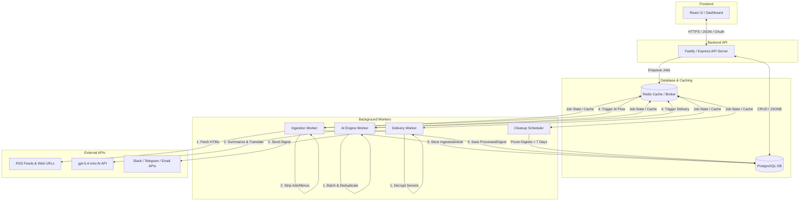

# Technology Requirements & Trade-off Analysis

This document defines the technology requirements for the **AI-Powered Personalized News Aggregator** and performs a detailed trade-off analysis of various software, database, and infrastructure choices before finalizing the project's technology stack.

---

## 1. Requirements Summary & Engineering Constraints

Based on the [business requirements](file:///home/ivdt/tmp/forremove/ai-course/my-project/2026-fwdays-agentic-greenfield-task/docs/1_business/requirements.md) and [non-functional requirements (NFRs)](file:///home/ivdt/tmp/forremove/ai-course/my-project/2026-fwdays-agentic-greenfield-task/docs/1_business/nfr.md), the chosen technologies must support:
*   **Asynchronous Background Tasks:** Heavy workloads (web scraping, HTML-to-text extraction, AI analysis, notification delivery) must run outside the request-response lifecycle of the API server.
*   **Shared Resource Caching:** Global deduplication of source fetching is required (fetch once per cycle, cache results, and serve all subscribing user flows).
*   **Structured Relational Schema:** Strong relationships between `User`, `ProcessingFlow`, `GlobalSource`, `DeliveryChannel`, and `ProcessedDigest` with support for complex metadata (interests, configurations).
*   **At-Rest Secret Encryption:** Sensitive user credentials (e.g., Slack webhook URLs, Telegram bot tokens, custom prompt templates) must be encrypted before being stored in the database.
*   **Data Pruning:** Strict 7-day retention policy for processed digests requires automated cleanup/purging jobs.
*   **Ecosystem Constraints:** Strict usage of the `gpt-5.4-mini` model for AI operations, and integration with third-party APIs (RSS feeds, SMTP, Slack, Telegram).

---

## 2. Trade-off Analysis by Component

### 2.1 Core Backend Runtime & Language
The backend runtime needs to handle both high-frequency network I/O (fetching RSS feeds and scraping web pages) and run background tasks (token counting, formatting, and calling AI APIs).

| Criterion | Node.js (TypeScript) | Python | Go |
| :--- | :--- | :--- | :--- |
| **I/O Performance** | Excellent (non-blocking event loop). | Good (via `asyncio`). | Outstanding (native goroutines). |
| **Ecosystem for Parsing** | Excellent. First-party support for `@mozilla/readability` and lightweight HTML parsers like `linkedom`. | Great. Powerful libraries (`BeautifulSoup`, `lxml`), but readability ports are less maintained. | Moderate. Limited reader-mode parsing libraries; often requires calling C bindings. |
| **AI Integration** | Excellent. Official OpenAI and AI SDKs are fully typed. | Outstanding. Python is the native tongue of the AI/ML world. | Moderate. Community-maintained or raw HTTP integrations. |
| **Development Velocity** | High. Shared types with the frontend (e.g., via TypeScript) simplify development. | High. Fast prototyping, but lack of unified types with frontend. | Moderate. More verbose, compiles fast but takes longer to write. |

> **Decision:** **Node.js (TypeScript)**
> *   *Rationale:* Unified language across the stack (frontend/backend) maximizes velocity. Node.js natively supports `@mozilla/readability` (the industry standard maintained by Mozilla for Safari/Firefox-like reader modes). Using JS-native Readability eliminates performance overhead or parsing discrepancies that occur in Python/Go ports.

---

### 2.2 Frontend Framework
The frontend must provide a responsive, premium user dashboard for configuring interest profiles, active sources, processing flows, and viewing saved digests (In-App delivery).

| Criterion | Single Page App (React + Vite) | Full-Stack (Next.js / Remix) | Server-Side Templates + HTMX |
| :--- | :--- | :--- | :--- |
| **Aesthetics & UX** | Outstanding. Fully stateful interactive UI components, smooth transitions. | Outstanding. Excellent performance and SEO. | Good. Responsive, but complex state management gets messy. |
| **Hosting & Complexity** | Very Low. Compiles to static assets (HTML/CSS/JS) hostable on CDN (e.g., Firebase Hosting). | Moderate to High. Requires Node.js server environment or serverless deployment. | Low. Tied directly to backend application server. |
| **Security (Decoupling)** | High. Frontend only communicates via authenticated API endpoints. | Moderate. Server-side code execution adds potential attack vectors if not isolated. | Low. Highly coupled to the backend routing and server-side state. |

> **Decision:** **React (SPA) with Vite**
> *   *Rationale:* The web app is a private dashboard (no SEO requirement), making client-side routing ideal. Decoupling the frontend into static assets minimizes server cost, allows cheap hosting via CDN, and separates presentation logic from database-heavy API and background worker tasks.

---

### 2.3 Primary Database
The database must support structural constraints, transactions, and flexible data types like string arrays (user interests, language preferences) and encrypted config blobs.

| Criterion | PostgreSQL | MySQL | SQLite |
| :--- | :--- | :--- | :--- |
| **Complex Data Types** | Excellent. Native arrays (e.g., `text[]` for interests) and `JSONB` for encrypted config schemas. | Good. JSON support is present but less flexible; no native array types. | Poor. No native array or robust JSON querying; lacks multi-user scaling. |
| **Concurrency & Workers** | Outstanding. Handles high volume of concurrent reads/writes from background workers. | Great. Excellent throughput, though slightly less flexible indexing. | Poor. Write-locking prevents concurrent database access by multiple workers. |
| **ACID Compliance** | Strongest standard. | Strong standard. | Moderate. |

> **Decision:** **PostgreSQL**
> *   *Rationale:* PostgreSQL's native `JSONB` is perfect for storing encrypted delivery configs (dynamic parameters for Slack/Telegram/Email), and its native arrays eliminate the need for verbose join tables for storing user interest lists or language preferences. It easily handles concurrent writes from background workers.

---

### 2.4 Cache & Message Broker
The system requires a message queue to handle background processing (ingestion, processing, delivery) and a global cache to store scraped websites to prevent redundant network hits.

| Criterion | Redis | RabbitMQ + Memcached | PostgreSQL (pg-boss / DB Queue) |
| :--- | :--- | :--- | :--- |
| **Unified Capability** | Yes. Handles both queuing (via BullMQ) and caching (key-value store). | No. Requires two separate services to manage queue and cache. | Partially. Can do queuing and basic caching, but at high DB CPU/disk expense. |
| **Performance** | Extremely High (sub-millisecond in-memory). | Extremely High. | Low. Database polling creates I/O bottlenecks. |
| **Setup & Maintenance** | Low. Single service to configure and deploy. | High. Two distinct, complex distributed architectures. | Very Low. Uses existing database, but degrades database performance. |

> **Decision:** **Redis**
> *   *Rationale:* Redis serves as a single infrastructure dependency that solves two major NFRs: high-performance message broker (using Redis streams for job queues) and memory-efficient key-value caching (global shared source cache).

---

### 2.5 Background Job Framework
We need a framework to manage background jobs (scraping, AI analysis, notifications) with retry logic, rate limiting, and dependencies (e.g., Source Fetched $\rightarrow$ Run AI processing $\rightarrow$ Trigger Delivery).

| Criterion | BullMQ (Node.js) | Celery (Python) | pg-boss (PostgreSQL) |
| :--- | :--- | :--- | :--- |
| **Job Dependencies** | Outstanding. Built-in support for parent-child job flows (e.g., flow grouping and batching). | Good. Complex workflows (chords, chains, groups) but harder to configure. | Minimal. Basic queuing, lacking robust step-chaining tools. |
| **Rate Limiting** | Built-in. Respects external API limits at queue level. | Requires external libraries or complex configurations. | Lacks native worker-level rate limiting. |
| **Dynamic Scheduling** | High. Supports repeatable jobs and dynamic delay configuration out-of-the-box. | Good (via Celery Beat), but config is less dynamic. | Minimal. |

> **Decision:** **BullMQ (backed by Redis)**
> *   *Rationale:* BullMQ is the leading Node.js job queue. It offers native parent-child job flow management (perfect for triggering ingestion first, combining articles, passing to AI, and sending outputs to delivery channels). It has built-in rate-limiting capabilities to protect external AI/Slack/Telegram APIs from 429 rate limit spikes.

---

### 2.6 Content Ingestion & Parsing
Raw HTML from web URLs must be stripped of ads, headers, and footers, extracting only readable content before passing to the AI model to save token costs.

| Option | Description | Trade-offs |
| :--- | :--- | :--- |
| **Mozilla `@mozilla/readability` + `linkedom`** | DOM-based extraction engine using a lightweight, fast, memory-efficient DOM parser (linkedom). | *Pros:* High reliability, identical parsing to Firefox Reader Mode. Memory-efficient compared to jsdom. *Cons:* Single-threaded JS environment (mitigated by worker pooling). |
| **Custom Cheerio Selectors** | CSS-selector-based manual parsing. | *Pros:* Very fast. *Cons:* High maintenance; breaks whenever a target website updates its HTML structure. Unusable for general URL ingestion. |

> **Decision:** **Mozilla `@mozilla/readability` + `linkedom`**
> *   *Rationale:* Web URLs vary wildly. General-purpose readability heuristics are required. Combining Mozilla's official parser with `linkedom` (a lightweight virtual DOM implementation that is up to 10x faster than `jsdom` and uses 4x less memory) ensures high quality text extraction at high throughput.

---

### 2.7 Data Deduplication Strategy
Similar news articles fetched from different sources must be grouped/deduplicated before AI processing to cut down token usage and avoid redundant summaries.

| Option | Method | Trade-offs |
| :--- | :--- | :--- |
| **MinHash / LSH (Locality Sensitive Hashing)** | Compares character n-grams to estimate Jaccard similarity. | *Pros:* Extremely fast, runs locally in O(N) complexity, very cheap. *Cons:* Misses semantic similarities (e.g., same news written with entirely different words). |
| **Vector Embeddings (e.g., text-embedding-3-small)** | Computes cosine similarity of high-dimensional vectors. | *Pros:* Captures true semantic similarity. *Cons:* High cost (requires API calls for every article), introduces latency, and adds API rate-limiting challenges. |
| **AI-driven Deduplication** | Asks `gpt-5.4-mini` to group them during the summary step. | *Pros:* Simple code logic. *Cons:* Huge context window inflation; high token costs. |

> **Decision:** **MinHash / Jaccard Similarity (Local Javascript)**
> *   *Rationale:* High performance and zero cost. Since the AI model (`gpt-5.4-mini`) will perform the final semantic synthesis, the pre-processing deduplication step only needs to group highly textually similar reports (e.g., syndicated AP/Reuters feeds republished across different news sites). A local Jaccard similarity check using n-grams is more than sufficient.

---

### 2.8 Security: Encrypting Secrets at Rest
Dynamic user-provided secrets (SMTP configurations, Slack Webhooks, Telegram bot tokens) must be stored securely.

| Option | Description | Trade-offs |
| :--- | :--- | :--- |
| **Application-Level AES-256-GCM** | The application encrypts values before database insertion using a Master Key from the environment variables. | *Pros:* Extremely fast, no external network dependencies, secure against database leaks/dumps. *Cons:* Compromise of the server environment variables leaks the Master Key. |
| **Database Encryption (PG pgcrypto)** | Database-level encryption function calls. | *Pros:* Keeps encryption inside SQL statements. *Cons:* Database logs and query processors might expose keys during execution. |
| **External Secrets Vault (AWS Secrets Manager / Vault)** | Calling an external service to fetch credentials on demand. | *Pros:* Enterprise-grade secret rotation and audit logging. *Cons:* Unacceptable API latency on every job delivery execution, plus high cost. |

> **Decision:** **Application-Level AES-256-GCM**
> *   *Rationale:* Symmetric encryption using AES-256-GCM with a unique Initialization Vector (IV) per encrypted record provides strong data protection. The Master Key is injected at runtime into the server environment (using standard cloud secret managers like GCP Secret Manager or AWS Systems Manager Parameter Store).

---

## 3. Final Selected Technology Stack

| Layer | Selected Solution | Justification |
| :--- | :--- | :--- |
| **Frontend UI** | React + TypeScript + Vite | Decoupled static frontend. Fast build, cheap hosting, clean separation. |
| **Styling** | Vanilla CSS (or HSL Tailwind if requested) | Responsive layout, modern aesthetics, fast styling iteration. |
| **API Server** | Node.js (TypeScript) + Fastify / Express | Type safety, high I/O handling, ecosystem compatibility with HTML parser. |
| **Database** | PostgreSQL | Robust JSONB for encrypted credentials, native arrays for interests, ACID. |
| **Cache & Queue Broker** | Redis | In-memory caching for fetched articles + BullMQ job queue broker. |
| **Job Queue Manager** | BullMQ | Support for parent-child job pipelines, retry-backoff, rate-limiting, cron. |
| **HTML Reader-Mode** | `@mozilla/readability` + `linkedom` | High-quality text extraction without heavy memory footprints. |
| **AI Model** | `gpt-5.4-mini` (via OpenAI SDK) | Defined business constraint. Used for synthesis, translation, and filtering. |
| **Security & Encryption** | AES-256-GCM | Encrypts delivery channels and custom prompts at rest in PostgreSQL. |
| **Data Retention Job** | Cron repeatable job in BullMQ | Automated daily execution of SQL deletes targeting records older than 7 days. |

---

## 4. System Architecture Data Flow

---

## 5. Security & Risk Analysis

### 5.1 Threat: SSRF (Server-Side Request Forgery) via Custom URLs
*   **Risk:** Users can submit internal IP addresses (e.g., `http://169.254.169.254/latest/meta-data`) as custom news sources, letting them scrape internal cloud metadata.
*   **Mitigation:** The Ingestion Worker must validate URLs before fetching. It must block private IP ranges (RFC 1918, loopbacks, link-local addresses).

### 5.2 Threat: Secret Key Exposure
*   **Risk:** If the database backup is leaked, all users' Slack webhooks and Telegram tokens are compromised.
*   **Mitigation:** Database configuration JSONs are encrypted with AES-256-GCM. The encryption key is *never* stored in the database or git; it is supplied as an environment variable (`ENCRYPTION_SECRET`) loaded dynamically at startup.

### 5.3 Threat: AI Token/Cost Abuse
*   **Risk:** Users bypass flow limitations or configure huge inputs that generate massive AI bills.
*   **Mitigation:** 
    1. Limit each user to exactly 5 active processing flows.
    2. Enforce strict character/word count truncation on ingested articles before payload assembly.
    3. Measure and log token usage (returned by the OpenAI response) in `ProcessedDigest` for usage analytics.
