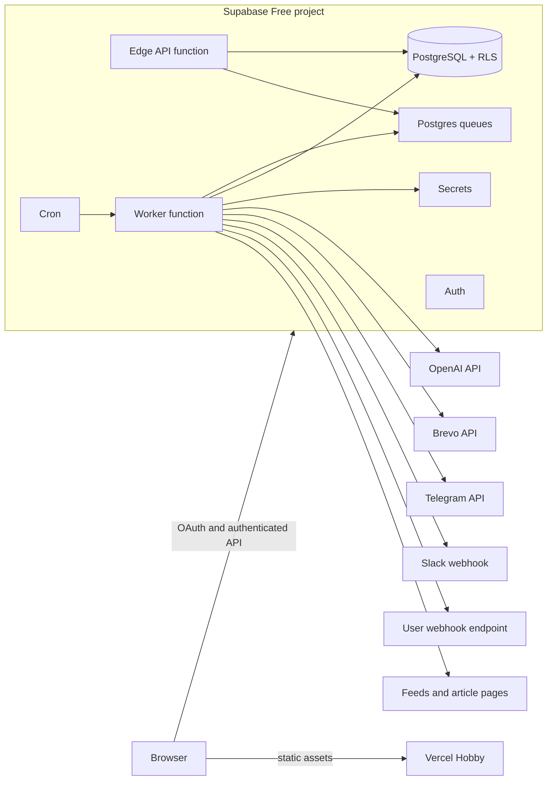

# Zero-Cost Hosting and Deployment

This document deploys the solutions selected in [`technology_requirements.md`](technology_requirements.md). Provider comparisons and technology choices are owned there; this file owns setup, topology, operations, and deployment consequences.

## 0. Upstream Decision Basis

| Hosting decision | Upstream inputs | Realization |
| --- | --- | --- |
| **H-01 — Static frontend** | `T-02`, `T-04`, `BR-PROJ-01..03`, `NFR-CON-04/07` | Vercel Hobby serves the Vite build; no Vercel Functions or Cron. |
| **H-02 — Managed backend** | `T-03`, `T-05..06`, `A-02..A-07` | One Supabase Free project hosts database, Auth, queue, schedules, functions, secrets, and logs. |
| **H-03 — Delivery integrations** | `BR-DEL-02..05`, `T-09..T-10` | Brevo and direct HTTP adapters; no additional application host. |
| **H-04 — Automated delivery** | `T-12..13`, `BR-PROJ-02..03`, `NFR-OPS-04`, `Q-01..Q-05` | Vercel Git deploy plus protected GitHub Actions for analysis, tests, migrations, and functions. |
| **H-05 — Free-tier operations** | `NFR-CON-04..08`, `T-03`, `T-05`, `T-10`, `T-13` | Public-repository tooling, explicit quotas, fail-closed behavior, monitoring, and paid-stack exit conditions. |
| **H-06 — Infrastructure as code** | `AT-01`, `AT-11`, `T-14`, `NFR-OPS-04` | Provider-native declarative files plus protected, idempotent bootstrap/deploy/audit automation. |

## 1. Deployment Selection

Use two hosted services:

| Component | Provider | Plan | Purpose |
| --- | --- | --- | --- |
| Static frontend | Vercel | Hobby | Build and serve the React/Vite assets with HTTPS, previews, and a generated `vercel.app` domain. |
| Backend platform | Supabase | Free | PostgreSQL, Auth, Row Level Security, Queues, Cron, Edge Functions, secrets, logs, and generated API. |

Use Brevo Free for email delivery and the provider APIs required by the product (OpenAI, Telegram, and Slack). Generic webhooks call user-owned HTTPS endpoints directly. These are integrations, not application hosts.

Vercel hosts static assets only. GitHub Actions runs CI and deploys Supabase changes but is not part of the running application. Supabase owns all stateful and scheduled runtime behavior.

### 1.1 Hosting alternatives summary

The detailed component analysis is in decisions `T-03` and `T-04` in [`technology_requirements.md`](technology_requirements.md). The deployment-level result is:

| Hosting option | Meets $0 target | Meets schedules/queues/data needs | Setup | Decision |
| --- | --- | --- | --- | --- |
| Vercel Hobby frontend + Supabase Free | Yes; its personal/non-commercial condition matches `BR-PROJ-01` | Yes: Supabase supplies relational data, Auth, queues, minute-level Cron, and functions | Two managed services with direct Git/Vite setup | **Selected** |
| Cloudflare Pages + Supabase Free | Yes, within quotas | Yes, because Supabase still provides the backend | Two managed services | Strong fallback, but no material simplicity advantage for this project |
| Full Vercel Hobby + external data services | Potentially | Not by itself: relational data, durable queue, and Auth still require external services; Hobby Cron cannot run the one-minute worker or 30-minute cleanup schedules | At least three services plus orchestration | Rejected |
| Single VPS | No | Yes | Server patching, TLS, backups, database, and queue operations | Rejected by `NFR-CON-04..05` |

### 1.2 Why Vercel only for the frontend?

Vercel Hobby is selected because the project is explicitly public, personal/educational, and non-commercial. Its Git integration, Vite support, preview deployments, generated HTTPS domain, and rollback workflow satisfy `NFR-CON-04..05` with minimal setup.

Vercel is not selected for the backend:

1. Hobby Cron runs at most once per day with hourly precision, while the application needs a worker every minute and cleanup every 30 minutes (`A-04`, `NFR-DATA-01`).
2. Relational storage, durable queues, database-level row isolation, and OAuth still require Supabase or several additional services.
3. Keeping Vercel static avoids duplicating the API/runtime boundary and keeps all stateful operations transactionally close to PostgreSQL.

If the project becomes commercial, `BR-PROJ-01` changes and `T-04` must be reassessed before continued deployment. Cloudflare Pages is the documented first fallback.

## 2. Cost Boundary

The expected infrastructure hosting bill is **$0/month** while the application remains within free-plan quotas. The claim has explicit boundaries:

- OpenAI API usage is not free and remains usage-billed.
- A custom domain is optional and is not included; the generated Vercel and Supabase domains work at no cost.
- Google and GitHub OAuth application registration is free.
- Telegram, Slack, and generic outbound webhooks do not add hosting cost, subject to remote platform policies and limits.
- Email remains free only within Brevo's free allowance.
- Free plans provide no uptime SLA and can change. Quotas must be reviewed before launch and monitored afterward.
- Supabase Free does not include automatic database backups. The $0 plan therefore has no guaranteed recovery point; upgrade before the stored configuration becomes business-critical.
- Vercel is used within Hobby's personal/non-commercial terms and included limits; the project does not use Vercel Functions or Cron.

## 3. Deployment Topology

## 4. One-Time Setup

### 4.1 Supabase

1. Create one Free project in the region nearest the expected users.
2. Link the repository with the Supabase CLI and commit migrations, function source, and local configuration.
3. Enable/configure Auth providers for Google and GitHub. Add production and localhost redirect URLs. Disable hosted email/password sign-up in production.
4. Apply migrations that create the application schema, row-level security policies, database functions, queues, and cron schedules.
5. Deploy the `api`, `schedule-daily`, and `work` Edge Functions.
6. Add backend secrets: OpenAI API key, encryption key, Brevo API key/sender, operator email, Telegram bot token, scheduler secret, and allowed frontend origin.
7. Invoke each scheduled function manually once, verify authorization, and inspect the recorded cron/job result before enabling users.
8. Run the infrastructure audit script and store its non-secret result as the initial desired-state baseline.

### 4.2 OAuth Providers

- Create a Google OAuth web client and a GitHub OAuth App.
- Use the Supabase callback URL shown by each provider configuration.
- Request only identity/profile/email scopes needed for sign-in.
- Keep provider client secrets in Supabase Auth configuration, never in Vercel browser variables.

### 4.3 Vercel

1. Import the public personal GitHub repository into a Vercel Hobby project.
2. Keep the project root at the repository root, then use the committed Vite workspace build and `packages/browser/dist` output settings from `vercel.json`.
3. Expose only the Supabase project URL and publishable key to the browser. These are intentionally public; authorization relies on JWT validation and RLS.
4. Configure the SPA fallback so client-side routes serve `index.html`.
5. Add the production `vercel.app` URL to Supabase Auth redirects and to the API CORS allowlist. Do not allow arbitrary preview origins in production CORS/Auth configuration.

If the repository is transferred to a GitHub organization, reassess `T-04`; Vercel Hobby cannot connect organization-owned Git repositories, so Cloudflare Pages becomes the default fallback.

### 4.4 Delivery Providers

- Verify one application-owned sender identity in Brevo and create a restricted transactional API key.
- Create one Telegram bot and store its token only in Supabase secrets.
- Slack webhook URLs are supplied per user/channel and encrypted by the API before storage.
- Generic webhook URLs and generated signing secrets are encrypted by the API. Test endpoints must return 2xx before activation.

### 4.5 CI/CD

- Vercel deploys the frontend from the production branch through its Git integration and creates preview deployments for pull requests.
- Supabase GitHub integration deploys migrations and the declared Edge Functions (`api`, `schedule-daily`, `work`, and `cleanup`) from `supabase/config.toml` when production deployment is enabled for `main`.
- A GitHub Actions workflow runs tests on pull requests. A future protected production workflow may use pinned Supabase CLI tooling to apply forward migrations and deploy Edge Functions if provider-managed GitHub deployment is replaced.
- Store the Supabase access token, project reference, and database password as GitHub environment secrets. Require approval for the production environment; never expose them to pull requests from forks.
- GitHub Actions is used only for analysis, tests, and deployment—not daily processing or cleanup. Standard hosted runners are free for the public repository.

### 4.6 Static analysis and public-repository security

1. Enable CodeQL advanced setup for `javascript-typescript` and `actions` with the `security-extended` query suite.
2. Enable Dependabot alerts and weekly update groups for npm and GitHub Actions.
3. Add Dependency Review, ESLint/`typescript-eslint`, `deno lint`, `tsc --noEmit`, `deno check`, Prettier, `deno fmt --check`, `actionlint`, tests, and migration validation to required pull-request checks.
4. Keep GitHub secret scanning enabled and retain user push protection. A detected secret requires revocation/rotation, not merely deleting it in a later commit.
5. Pin third-party Actions to full commit SHAs and review Dependabot updates before merge.
6. Configure the default branch ruleset to block merging when required checks fail or high/critical security findings remain unresolved.

### 4.7 Infrastructure as code workflow

The initial release uses the provider-native IaC selected in `T-14`:

| Repository path | Managed infrastructure/configuration |
| --- | --- |
| `supabase/migrations/` | Tables, constraints, RLS, database functions, queues, schedules, retention, Vault references |
| `supabase/config.toml` | Local Supabase/Auth/function configuration supported by the CLI |
| `supabase/functions/` | Versioned API, scheduler, worker, and shared Edge Function code |
| `vercel.json` | SPA routing, response/security headers, and repository-supported Vercel settings |
| `.github/workflows/` | CI, CodeQL, migration validation, protected deployment, and infrastructure audit |
| `.github/dependabot.yml` | npm and GitHub Actions update policy |
| `infra/scripts/` | Idempotent bootstrap/audit for GitHub rules and provider settings not represented by native files |
| `.env.example` | Required variable names and descriptions without values |

Pull requests run format/validation, migration checks, and read-only infrastructure audits. Merge to the protected production branch applies migrations and deploys functions; Vercel deploys the static frontend from Git. Mutating bootstrap scripts require explicit production-environment approval and must be safe to rerun.

The following remain manual but documented: creating personal GitHub/Vercel/Supabase accounts/projects, registering Google/GitHub OAuth applications, linking the repository initially, and entering secrets. The audit script verifies their non-secret observable settings afterward.

Do not commit IaC state, provider tokens, plan files containing sensitive values, `.env` files, database dumps, or generated provider-link directories. If OpenTofu is adopted later, use encrypted locked remote state and protected CI-only apply.

## 5. Scheduled Operations

Supabase Cron owns all recurring work:

| Schedule | Operation | Failure behavior |
| --- | --- | --- |
| Every day at 06:00 UTC | Enqueue due source and flow work | The next worker run processes durable queued work. Duplicate cycle keys are ignored. |
| Every minute | Invoke the worker for at most one job | Unacknowledged messages become visible after their lease. Five failures move to dead-letter state. |
| Every 30 minutes | Delete content older than seven days and recover expired leases | Record the run; alert after two consecutive failures. |

Cleanup is a database-side operation, so it does not depend on a frontend host or GitHub Actions scheduling. Queue messages contain identifiers only; deleting expired articles and digests removes the content even if operational queue metadata remains.

## 6. Free-Tier Risks and Controls

### Supabase project pausing

Supabase may pause a low-activity Free project after seven days. Scheduled work is expected to create regular database activity, but this is not an uptime guarantee. Configure owner email alerts and treat a pause as an accepted limitation of the $0 plan. If unattended availability is required, zero-cost hosting is not a valid production requirement.

### Function limits

Workers process one job per invocation and stop after 100 seconds. Expensive parsing and deduplication must have representative integration/load tests because edge functions have CPU, memory, and wall-clock limits. A timeout leaves the queue message unacknowledged for retry.

### Storage

The seven-day content purge is the primary storage control. Add alerts at 300 MB and 400 MB. Queue payloads store IDs only, dead-letter records contain sanitized error metadata, and no database backups containing ephemeral article/digest content are exported on the free plan.

### Backup and recovery

Supabase Free has no automatic backups. For the initial non-critical release, migrations in source control rebuild the schema and loss of hosted data is an accepted risk. Do not copy production database dumps into CI artifacts or source control: they would contain user identity/configuration data and could extend retained content. If an operational recovery-point objective is introduced, move to a plan with managed backups and define encrypted backup retention before launch.

### No automatic overage

Keep every provider on a plan that stops or rejects work when its free allowance is exhausted. The application records the provider error and retains retryable work; operators decide whether to wait, reduce load, or upgrade.

## 7. Deployment and Rollback

- Pull requests run lint, type checking, unit tests, migration validation, Edge Function integration tests, and the frontend build.
- Pull requests validate declarative infrastructure and run read-only drift/audit checks; they never apply production changes.
- Merge to the production branch deploys the Vercel frontend and Supabase functions. Database migrations run as an explicit protected CI step before functions that require them.
- Migrations must be backward compatible for one deployment window: add schema first, deploy code, then remove obsolete schema in a later change.
- Roll back frontend/functions by redeploying the previous artifact. Database rollback uses a tested compensating migration; destructive down-migrations are not automatic.
- After deployment, run smoke checks for login, an authorized API read, queue publish/claim, a non-delivering test flow, and cleanup against seeded expired test data.

## 8. Production Readiness Checklist

- Google and GitHub production callbacks work.
- Production password sign-up is disabled.
- RLS tests prove cross-user reads/writes fail for every user-owned table.
- SSRF tests cover source and webhook URLs, redirects, IPv4/IPv6 private ranges, DNS rebinding, and metadata endpoints.
- Encryption round-trip and key-version tests pass; logs contain no plaintext secrets.
- Queue retry, lease recovery, idempotency, and dead-letter tests pass.
- The 30-minute cleanup schedule is enabled and monitored.
- Provider keys and sender/chat/Slack/generic-webhook setup are validated with test deliveries.
- Free-tier usage alerts and owner notification emails are configured.
- CodeQL, Dependabot, Dependency Review, secret scanning, push protection, and required branch checks are enabled.
- A clean checkout can validate all IaC; bootstrap/audit scripts are idempotent; no secret or IaC state file is tracked.
- The operator accepts that $0 hosting has no SLA and that OpenAI calls still incur usage cost.

## 9. Verified Platform References

External limits and plan behavior were checked on 2026-07-01:

- [Vercel Hobby](https://vercel.com/docs/plans/hobby) documents its personal/non-commercial restriction and included usage; [Vercel limits](https://vercel.com/docs/limits) document Git organization repository restrictions; [Vercel Cron limits](https://vercel.com/docs/cron-jobs/usage-and-pricing) explain why scheduling remains in Supabase.
- [Cloudflare Pages limits](https://developers.cloudflare.com/pages/platform/limits/) support the documented fallback comparison.
- [Supabase pricing](https://supabase.com/pricing) documents the Free database, Auth, Edge Function, storage, and egress allowances.
- [Supabase project pausing](https://supabase.com/docs/guides/platform/free-project-pausing) documents inactivity behavior and restoration.
- [Supabase Cron](https://supabase.com/docs/guides/cron), [Queues](https://supabase.com/docs/guides/queues), and [Edge Function limits](https://supabase.com/docs/guides/functions/limits) document the scheduled worker design and its constraints.
- [GitHub Actions billing](https://docs.github.com/en/actions/concepts/billing-and-usage), [CodeQL](https://docs.github.com/en/code-security/concepts/code-scanning/codeql/codeql-code-scanning), [Dependency Review](https://docs.github.com/en/code-security/concepts/supply-chain-security/dependency-review), and [secret scanning](https://docs.github.com/en/code-security/reference/secret-security/secret-scanning-scope) document the public-repository tooling used here.
- [Supabase deployment](https://supabase.com/docs/guides/deployment) documents its repository/CLI deployment model; [Vercel's Terraform integration](https://vercel.com/kb/guide/integrating-terraform-with-vercel) and [OpenTofu state encryption](https://opentofu.org/docs/v1.10/language/state/encryption/) document the deferred stateful IaC alternative.

## 10. Traceability Check

The deployment is valid only while it continues to implement `T-01..T-14` and satisfy `NFR-CON-04..08`. Commercial use, repository privatization, multiple long-lived environments, or a provider-limit change is first reassessed in the business/technology layers; hosting is then updated to implement the resulting decision.
